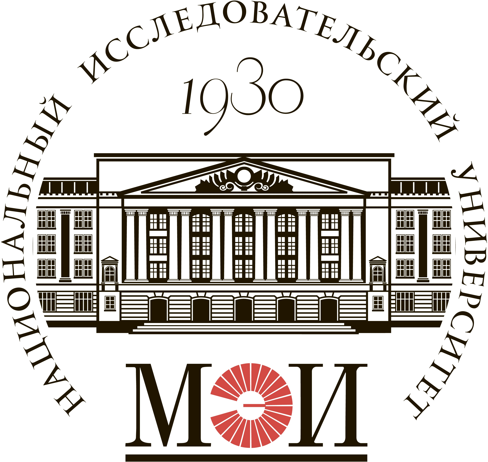

### Привет! Меня зовут Евгений  :wave:

<table width="100%" border='0'>
   <tr>
    <tr><td width="30%" valign="bottom"></td><td valign="middle">Школа инженеров по автоматизации тестирования <a target="_blank" href="https://qa.guru">qa.guru</a>.<td valign="middle"> 2022</tr>
    <tr><td width="30%" valign="bottom"></td><td valign="middle"> <a target="_blank" href="https://qa.guru">Национальный исследовательский университет "МЭИ"</a>. Институт информационных и вычислительных технологий. Автоматизированные системы обработки информации и управления.<td valign="middle">2013-2017</tr>
   </tr>
  </table>
 

## [Дипломный проект по автоматизации тестирования сайта и мобильного приложения Drom.ru](https://github.com/pashuh/project_drom) 

Реализован во время обучения в Школе инженеров по автоматизации тестирования <a target="_blank" href="https://qa.guru">qa.guru</a>

:iphone: <a target="_blank" href="https://t.me/pashuh">t.me/pashuh</a>
